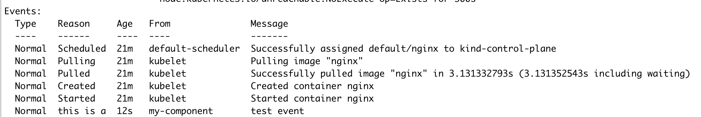

PoC to create events on a pod. Based on https://dev.to/lucassha/writing-events-to-pod-objects-using-client-go-1p1h

### How to run
Create a pod in your cluster in the default `default` namespace
```
kubectl run nginx --image=nginx
```

```
go run main.go
```

Check the event using `kubectl` 


Use `ctrl/cmd+c` to exit the process. 